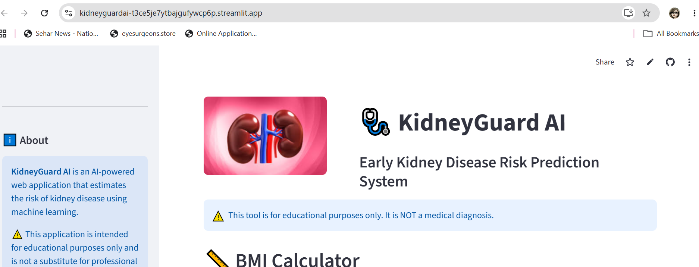
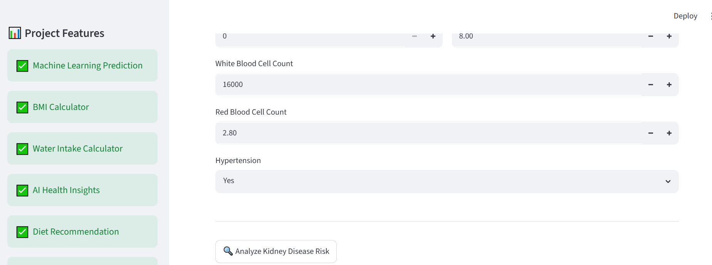
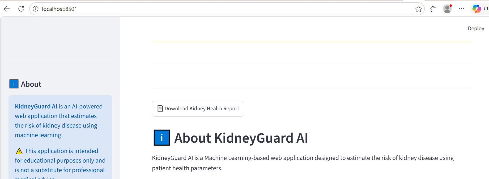
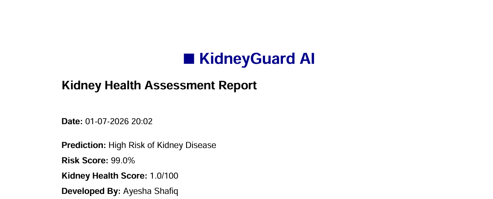

# 🩺 KidneyGuard AI

AI-powered Kidney Disease Risk Prediction System using Machine Learning and Streamlit.

## 🌐 Live Demo

https://kidneyguardai-t3ce5je7ytbajgufywcp6p.streamlit.app/

## 📂 GitHub Repository

https://github.com/ayeshacs7/KidneyGuard_AI

---

# 📖 Project Overview

KidneyGuard AI is a Machine Learning-powered healthcare application that estimates the risk of kidney disease using patient clinical data.

The application analyzes medical parameters and provides an AI-based prediction to help users better understand their kidney health.

---

# ✨ Features

- 🩺 Kidney Disease Risk Prediction
- 📊 Risk Percentage
- 💚 Kidney Health Score
- ⚖️ BMI Calculator
- 💧 Daily Water Intake Calculator
- 🤖 AI Health Insights
- 🥗 Personalized Diet Recommendations
- 📄 PDF Health Report
- 📜 Prediction History
- 🌐 Interactive Streamlit Interface

---

# 🧠 Machine Learning

- Algorithm: Random Forest Classifier
- Framework: Scikit-learn
- Model Serialization: Joblib
- Data Processing: Pandas & NumPy

---

# 🛠 Technologies Used

- Python
- Streamlit
- Scikit-learn
- Pandas
- NumPy
- Joblib
- Matplotlib
- Plotly
- ReportLab

---

# 📂 Project Structure

```
KidneyGuard_AI/
│
├── app.py
├── requirements.txt
├── README.md
├── prediction_history.csv
│
├── dataset/
├── images/
├── models/
│     └── model.pkl
│
└── reports/
```

---

# 🚀 How to Run

```bash
git clone https://github.com/ayeshacs7/KidneyGuard_AI.git

cd KidneyGuard_AI

pip install -r requirements.txt

streamlit run app.py
```

---

# 👩‍💻 Developer

**Ayesha Shafiq**

Computer Science Teacher | AI & Machine Learning Enthusiast

---

# ⚠️ Disclaimer

This application is developed for educational purposes only.

It is **NOT** a medical diagnosis tool.

Always consult a qualified healthcare professional for medical advice.
# 📸 Application Screenshots

## 🏠 Home Page



---

## 📊 Prediction Result



---

## 📄 PDF Download



---

## 📑 Sample PDF Report


